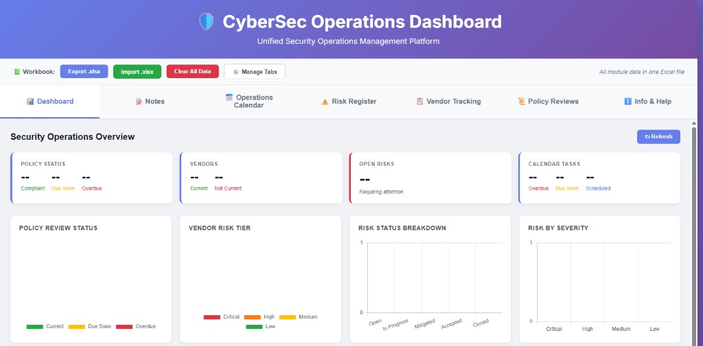

# CyberSec Operations Dashboard

A fully static, browser-based security operations management platform. No server, no database, no installation — deploy directly to GitHub Pages and run entirely in the browser.



---

## Overview

The CyberSec Operations Dashboard is a unified tool for managing day-to-day security operations. It consolidates task scheduling, risk tracking, vendor management, policy reviews, and notes into a single interface backed by a single Excel workbook. All data lives in the workbook you import and export — nothing is stored on a server.

---

## Features

### Modules

| Tab | File | Description |
|-----|------|-------------|
| Dashboard | `dashboard.html` | KPI cards and charts — security operations at a glance |
| Notes | `notes.html` | Free-form security operations notes and meeting records |
| Operations Calendar | `calendar.html` | Monthly calendar for scheduling and tracking security tasks |
| Risk Register | `riskregister.html` | Risk tracking with probability/impact scoring and visualizations |
| Vendor Tracking | `vendor-tracking.html` | Third-party vendor inventory and security review status |
| Policy Reviews | `policy-reviews.html` | Policy inventory with review schedules and compliance framework mapping |
| Info & Help | *(built into index)* | Usage guide and field reference |

### Dashboard

The default landing tab provides a live summary of the imported workbook data:

**KPI Cards**
- **Open Risks** — Count of risks with status Open or In Progress
- **Policy Status** — Compliant / Due Soon (within 30 days) / Overdue counts
- **Vendors** — Current vs Not Current vendor review status, with total count

**Charts**
- Risk by Severity (bar) — Critical / High / Medium / Low distribution
- Policy Review Status (doughnut) — Current / Due Soon / Overdue
- Vendor Risk Tier (doughnut) — Critical / High / Medium / Low
- Risk Status Breakdown (bar) — Open / In Progress / Mitigated / Accepted / Closed

A **Refresh** button re-applies the last imported data, with a last-updated timestamp displayed alongside it.

### Data Management

- **Import .xlsx** — Load all modules at once from a single Excel workbook. Each sheet maps to a module. Dashboard KPIs and charts update automatically on import.
- **Export .xlsx** — Save all current data back to a workbook in the same format, ready to re-import.
- **Clear All Data** — Wipe all modules and start fresh.
- Individual modules also support CSV import/export for working with a single data set.

### Calendar
- Monthly view with color-coded priority indicators
- Task status tracking: `Not Started`, `In Progress`, `Completed`
- Add, edit, and delete events with owner assignment and notes
- Recurring event support (daily, weekly, monthly, yearly)
- Status toggle cycles tasks through their workflow states

### Risk Register
- Automatic severity scoring (Probability × Impact)
- Severity levels: Critical, High, Medium, Low
- Filtering by status, severity, and owner
- Risk timeline and severity distribution charts
- People/owner management

### Vendor Tracking
- Full vendor inventory with classification and risk rating
- Security review status (`Current` / `Not Current`) and review date tracking
- Contact information and administration notes
- If the Excel "Current" column uses a formula, the app computes the value from the Review Date automatically

### Policy Reviews
- Policy inventory with compliance framework tagging
- Review frequency scheduling and next-review date tracking
- If the Excel "Status" column uses a formula, the app computes Current/Overdue from the Next Review date automatically
- Supports HIPAA, SOC 2, NIST CSF 2.0, ISO 27001, PCI DSS

---

## Getting Started

### Deploy to GitHub Pages

1. Fork or clone this repository
2. Go to **Settings → Pages**
3. Set source to `main` branch, root directory
4. Your dashboard will be live at `https://<your-username>.github.io/<repo-name>/`

### Run Locally

No build step required. Just open `index.html` in any modern browser:

```bash
git clone https://github.com/your-username/your-repo.git
cd your-repo
open index.html
```

Or serve with any static file server:

```bash
python3 -m http.server 8000
# then open http://localhost:8000
```

---

## File Structure

```
/
├── index.html                     # Dashboard shell — tabs, import/export, navigation
├── dashboard.html                 # Dashboard module — KPI cards and charts
├── calendar.html                  # Operations Calendar module
├── riskregister.html              # Risk Register module
├── vendor-tracking.html           # Vendor Tracking module
├── policy-reviews.html            # Policy Reviews module
├── notes.html                     # Notes module
├── CyberSec_Dashboard_Data.xlsx   # Sample workbook with example data
└── README.md
```

---

## Workbook Format

The Excel workbook contains one sheet per module. Column headers must match exactly (title case):

**Calendar**
`Date` | `Task` | `Category` | `Priority` | `Status` | `Owner` | `Notes`

**Risk Register**
`Title` | `Description` | `Category` | `Probability (Before)` | `Impact (Before)` | `Severity Score (Before)` | `Severity Level (Before)` | `Probability (After)` | `Impact (After)` | `Severity Score (After)` | `Severity Level (After)` | `Status` | `Owner` | `Mitigation Plan` | `Notes` | `Date Created` | `Date Modified`

**Vendors**
`Vendor Name` | `Vendor Type` | `Business Purpose` | `Information Classification` | `Risk Rating` | `Information Security Review` | `Current` | `Notes` | `Contact Information` | `Review Date` | `Type Review` | `Vendor Technical Contact` | `Responsible Team` | `Administration Portal Link` | `Integration Type` | `Administration Responsibilities` | `Administration Notes`

- `Risk Rating` accepted values: `Low`, `Medium`, `High`, `Critical`
- `Current` accepted values: `Current`, `Not Current`, `N/A` — if a formula is used, the app derives the value from `Review Date`

**Policy Reviews**
`Policy Name` | `Policy ID` | `Description` | `Policy URL` | `Category` | `Compliance Framework` | `Review Frequency` | `Status` | `Last Reviewed` | `Next Review` | `Effective Date` | `Version` | `Owner` | `Approver` | `Notes`

- `Status` — if a formula is used (e.g. `=IF(NextReview>TODAY(),"Current","Overdue")`), the app derives the value from `Next Review`

**Notes**
`Title` | `Date` | `Category` | `Priority` | `Author` | `Content` | `Tags`

The included `CyberSec_Dashboard_Data.xlsx` sample file contains example data for all modules and serves as a formatting reference.

---

## Architecture

### How It Works

The dashboard uses an **iframe + postMessage** architecture:

- `index.html` is the shell. It handles all workbook import/export and renders the tab navigation.
- Each module (`dashboard.html`, `calendar.html`, etc.) runs in its own `<iframe>`.
- On import, `index.html` parses the xlsx, extracts each sheet, and sends the rows to the appropriate iframe via `postMessage`. It also sends a `dashboardData` message to `dashboard.html` with the raw rows for risk, vendor, and policy sheets.
- On export, `index.html` requests data from each iframe via `postMessage`, collects the responses, and assembles the workbook.

### Message Protocol

Each module iframe listens for these message types:

```js
// Receive imported data
{ type: 'importDataFromWorkbook', module: '<name>', data: [...rows] }
// → reply with:
{ type: 'importComplete', module: '<name>', count: N }

// Provide data for export
{ type: 'getDataForExport' }
// → reply with:
{ type: 'exportData', module: '<name>', data: [...rows], headers: [...] }

// Clear all data
{ type: 'clearAllData' }
```

The dashboard iframe additionally listens for:

```js
// Push summary data to dashboard on import
{ type: 'dashboardData', data: { risks: [...], vendors: [...], policies: [...] } }

// Re-send last data when Refresh button is clicked
{ type: 'refreshResponse', data: { ... } }
```

### Dependencies

| Library | Version | How loaded | Used for |
|---------|---------|-----------|----------|
| Chart.js | 4.4.0 | CDN (jsdelivr) | Dashboard charts and risk register charts |
| xlsx parsing | custom | Bundled inline in `index.html` | Reading/writing .xlsx files |

All xlsx parsing uses a self-contained pure JavaScript implementation bundled directly into `index.html` — no CDN dependency for core data operations.

### Excel Formula Handling

The xlsx parser reads **cached cell values** from the `<v>` element in the XLSX format. For cells containing formulas that use volatile functions like `TODAY()`, Excel may not store a cached value. In these cases:

- **Vendor `Current`** — derived from `Review Date`: future date → `Current`, past → `Not Current`
- **Policy `Status`** — derived from `Next Review`: future date → `Current`, past → `Overdue`
- **Error cells** (`#N/A`, `#VALUE!`, etc.) — treated as empty

### Data Persistence

- **Session-based**: Calendar, Vendor Tracking, and Policy Reviews data lives only in memory during the session. Export before closing to save your work.
- **localStorage**: Notes and Risk Register persist across sessions in the browser's localStorage.
- **Workbook**: The xlsx workbook is the primary persistence mechanism — import at the start of a session, export when done.

---

## Compliance Framework Coverage

The dashboard is designed with the following frameworks in mind:

- **HIPAA Security Rule** — Risk assessment, access controls, audit logging, policy management
- **SOC 2** — Evidence collection, vendor reviews, policy tracking, operational procedures
- **NIST CSF 2.0** — Risk register mapping, policy controls, incident tracking
- **ISO 27001** — Asset management, risk treatment, policy reviews
- **PCI DSS** — Vendor management, vulnerability tracking, access reviews

---

## Browser Support

Requires a modern browser with support for:
- ES6+ JavaScript
- `postMessage` API
- `FileReader` API
- `Blob` / `URL.createObjectURL`
- `DecompressionStream` API (for xlsx parsing)

Tested in Chrome, Firefox, Edge, and Safari (latest versions).

---

## License

MIT License — free to use, modify, and distribute.
