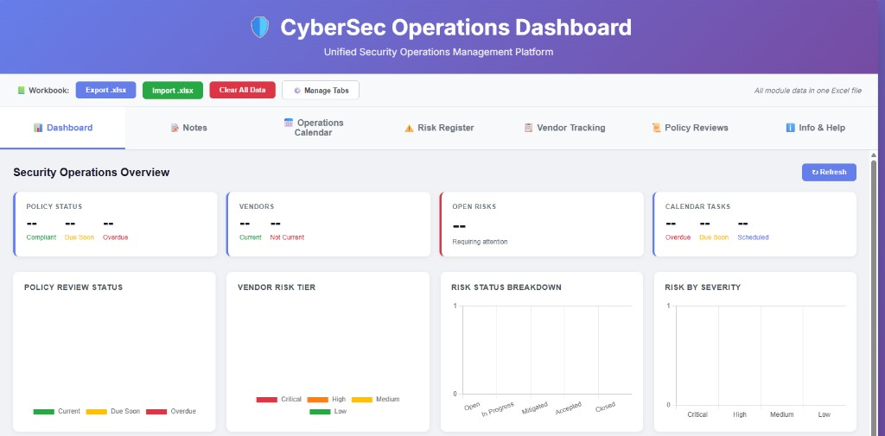

# CyberSec Operations Dashboard

A browser-based security operations management platform for vCISOs. No server, no database, no installation required.

---

## Use It Now

**Live app:** [https://cosmicv.github.io/cybersec-dashboard/](https://cosmicv.github.io/cybersec-dashboard/)

Or download the repository as a ZIP, extract it, and open `index.html` in any modern browser — it runs entirely from your local folder with no setup required.

---

## What It Does

The dashboard consolidates day-to-day security operations into a single interface backed by a single Excel workbook. Import your workbook at the start of a session, work across all modules, and export when you're done. Nothing is stored on a server.

### Modules

| Tab | Description |
|-----|-------------|
| Dashboard | KPI summary cards and charts aggregated from all modules |
| Operations Calendar | Monthly calendar for scheduling and tracking security tasks |
| Risk Register | Risk tracking with probability/impact scoring and a 5×5 heatmap |
| Vendor Tracking | Third-party vendor inventory and annual security review status |
| Policy Reviews | Policy inventory with review schedules and compliance framework mapping |
| Notes | Free-form security operations notes and meeting records |

### Data Management

- **Import .xlsx** — Load all modules at once from a single Excel workbook
- **Export .xlsx** — Save all data back to a workbook, ready to re-import next session
- **Client name** — Stored in the workbook and displayed in the toolbar
- **Tab visibility** — Show or hide individual tabs; state is saved in the workbook

The included `CyberSec_Dashboard_Data.xlsx` file contains sample data for all modules and serves as a formatting reference for your own data.

---

## Compliance Frameworks

Designed to support security operations across:

- HIPAA Security Rule
- SOC 2
- NIST CSF 2.0
- ISO 27001
- PCI DSS

---

## License

MIT — free to use, modify, and distribute.
